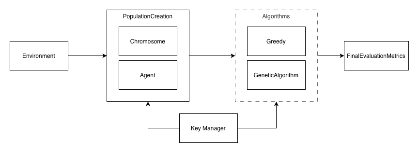

# Human Inspired Genetic Algorithms for Multi-Agent Evacuation Routing Code Base README
This repository contains the code used to generate the results in the dissertation submitted. The below image shows a high level view of the classes and how they interact.



## Repository Set Up
This repository used `Python 3.13.3` to run the code with the key libraries being: JAX, Numpy, Pandas, NetworkX and Matplotlib.

In order to run the code you will need to:
1. [Optional] Create and activate a virtual environment: `python -m venv venv'.
2. Install the requirements: `pip install -r requirements.txt`

## Running the code
### Python Files
The main files used to run the code can be seen below:

| File Name | Use |
| --------- | --- |
| main.py | Definition of the functions used to run the greedy and genetic algorithm. These functions run the algorithms and also store all the required metrics. These function(s) can be used to explore different parameter combinations and human behaviour exploration. |
| tuning.py | This file allows for parallel processing of the experiments which needed running. The file was adapted depending on the parameters being run so is left in the format which the last experiments were run in. |
| simple_run.py | This file allows for a single run of the genetic algorithm, often used for debugging purposes due to the single seed option. |

### Notebooks
All the results and plots shown in the dissertation work will be found in the following notebooks. The numbers represent the sequential order they should go through but the file names should also allow for clear investigations alongside the dissertation if required.

* `0_agent_implementation_plots.ipynb` - plots generated for implementation dissertation chapter.
* `0_city_creation.ipynb` - notebook used to create the final topology plots. Topology metrics and visualisations can be found here.
* `1_algorithm_information.ipynb` - notebook for writing down algorithm notes and also checking outputs across different seeds to ensure variation.
* `2_genetic_algorithm_hyperparams.ipynb` - sequential hyperparamter tuning results and nodes.
* `2_greedy_algorithm.ipynb` - runs the greedy algorithm for varying number of agents and assess the results.
* `3_compare_algorithms.ipynb` - initial investigations into comparisons between algorithms (pre-experiment running). Initial dispersion and route density plots can be found here.
* `5_1_baseline_comparison.ipynb`, `5_2_walking_speed_comparison.ipynb`, `5_3_delayed_starts_comparison.ipynb`, `5_4_compliance_comparison.ipynb` and `5_5_combined_human_factors_comparison.ipynb` all align to the results section of the disertation and include any plots, nodes or code to extract these results.
    * `5_behavioural_extensions_notes_and_thinking.ipynb` - initial notes and invesigations into data behind human behaviours.

## Result Recreation
All the experiments are stored in the `outputs/` folder with the experiment tunings in `tunings/` and results in `results`. You can load these in using the `extract_results` function in the `comparison_metrics.py` file or alternatively using the code below.

```python
def extract_results(path):
    with open(path, "rb") as f:
        results = pickle.load(f)

    return results
```

These pickles will include all the information which you can plug into either the `main.py` or `simple_run.py` files above (ensuring to use the same seed) and should create the same results as described in the notebooks / dissertation.

If you wanted to run for a different topology follow the steps in `0_city_creation` and then input the appropriate name into the functions which is fed into the `Environment` class.