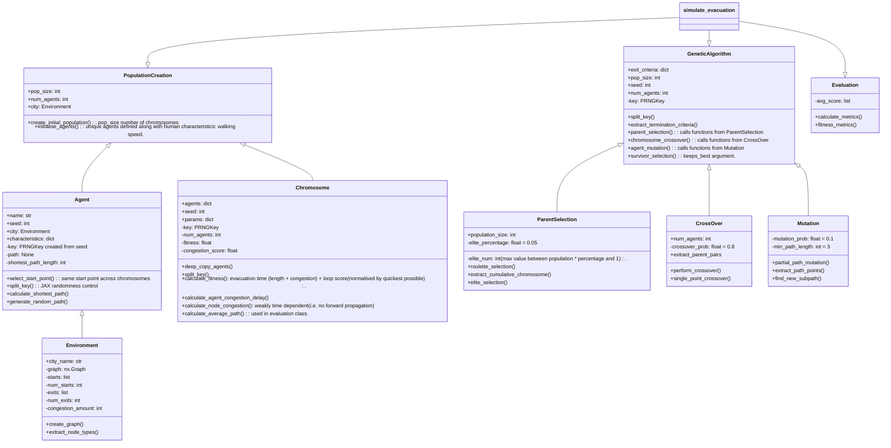

### 🧬 PopulationCreation
💡 **Info:**  
Creates the initial population of chromosomes and agents. Each chromosome (x6724) and Agent (x1235) has their own seed.  

⚠️ **TODO:**  
Altruism, Vulnerability, Familiarity, and Panic.

---

### 🌍 Environment
💡 **Info:**  
Loads in the created environment.  

⚠️ **TODO:**  
Congestion amount is an absolute guess.

---

### 🤖 Agent
💡 **Info:**  

⚠️ **TODO:**  
- Add familiarity into the initial path generation (candidate solutions).  
- The agents are currently allowed to go back on themselves in the initial path generation — do I want this?

---

### 🧬 Chromosome
💡 **Info:**  
Both human and environment parameters are controlled here.

⚠️ **TODO:**  
Probably need to split the human into unqiue characteristics as right now its just all human traits "ON".

---

### 🧬 GeneticAlgorithm
💡 **Info:**  
This is basically the class which triggers the operators of the genetic algorithm for each evolution of the algorithm - although the operators are called in the main file.
* Parent Selection - elite selection + roulette (where elite chromosomes make up 5% of the population)
* CrossOver - single point crossover
* Mutation - partial path mutation

⚠️ **TODO:**  
* Exit criteria functionality is currently only exceeding the number of evolutions and probably needs more, for example:
    * Stop if the fitness stops improving such as below a certain threshold over the last `n` generations.
    * Fitness threshold - stop if the solution is very good (I don't think I'll get to this point...)
* Might want to remove the elite selection or see how it performs without it...
* Decide if want to keep best or not in population selection - sort of same as above.

---

### 🌍 ParentSelection
💡 **Info:**  
Handles the selection of parents from a population for the next generation in an evolutionary algorithm. It is a combination of elite and roulette selection where the amount of elite parents is defined at the max value between `1` and `population size * percentage`.

⚠️ **TODO:**  
* Might want to remove the elite selection or see how it performs without it.

---

### ✂️ CrossOver
💡 **Info:**
Performs genetic crossover on a list of parent chromosomes to generate offspring. Uses single-point crossover for agents within each chromosome, with a configurable crossover probability.

⚠️ **TODO:**
* Probably need to think about tuning the cross over probability number a bit more.

---

### 🧬 Mutation
💡 **Info:**
Performs partial path mutations on chromosomes’ agents to introduce variation. Each agent has a chance (mutation_prob) to alter part of its path while keeping most of the original structure intact.

⚠️ **TODO:**
* Probably need to think about tuning the mutation probability number a bit more especially when start adding in the panic factor.
* Need to just understand this again as feels a bit hacked from trying to get it to work...

---

### 📊 Evaluation
💡 **Info:**
Calculates fitness and performance metrics for a population of chromosomes at each evolution step. Tracks average, best, and worst fitness as well as path-based and congestion-related metrics.

⚠️ **TODO:**
* Add congestion index calculations beyond the simple mean.
* Add exit utilization balance to measure how evenly exits are used.
* Consider metrics for altruism impact, e.g., total time steps agents wait or help others.
